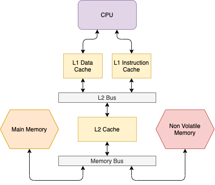

# NVM Guide




We simulate the system described in the above figure.

## 1. Environment configuration

### 1.1. Environment setup 
Install a VM with [Ubuntu 20.04 LTS](https://ubuntu.com/#downlaod).

Then, install all the requirements:
```
sudo apt update
sudo apt upgrade -y
sudo apt install -y build-essential git m4 scons zlib1g zlib1g-dev libprotobuf-dev protobuf-compiler libprotoc-dev libgoogle-perftools-dev libboost-all-dev python-dev python libpng-dev python-six libhdf5-dev graphviz python3-pip
sudo pip3 install pydot
```

Then, if you want to cross-compile for the arm architecture, you need to run the following command:
```
sudo apt install gcc-aarch64-linux-gnu g++-aarch64-linux-gnu
```

Now clone this repo:
```
git clone git@bitbucket.org:maiux/advancessocdesign.git
```

To understand how to configure the system and how it works, please read the following sections.
Note that all the steps of the next sections are already applied to the `gem5-20.1` directory.

### 1.2. Download gem5 v20.1
We need gem5 v20.1.0.2, as this is the version with non-volatile memory (NVM) support.

First, clone gem5 repository:
```
git clone https://gem5.googlesource.com/public/gem5
```

Then, enter gem5 directory and checkout version 20.1.0.2:
```
cd gem5
git checkout v20.1.0.2
```

Now run the following command to verify that you correctly switched to the v20.1.0.2:
```
git log
```

The first few lines should report:
```
commit 0d703041fcd5d119012b62287695723a2955b408 (HEAD -> stable, tag: v20.1.0.2)
Author: Bobby R. Bruce <bbruce@ucdavis.edu>
Date:   Wed Nov 11 13:34:23 2020 -0800

    misc: Updated the RELEASE-NOTES and version number

    Updated the RELEASE-NOTES.md and version number for the v20.1.0.2
    hotfix release.

    Change-Id: Ibb6b62a36bd1f9084f7d8311ff1f94b8564dbe9b
    Reviewed-on: https://gem5-review.googlesource.com/c/public/gem5/+/37435
    Reviewed-by: Bobby R. Bruce <bbruce@ucdavis.edu>
    Maintainer: Bobby R. Bruce <bbruce@ucdavis.edu>
    Tested-by: kokoro <noreply+kokoro@google.com>
```

Now press q to exit.

Note that if you are not able to switch to v20.1.0.2 using the previous checkout command, you can run:
```
git checkout 0d703041fcd5d119012b62287695723a2955b408
```

### 1.2. Compile gem5 for X86
Check the number of cores/threads that your machine have using the command `nproc`. Then, run the following command, where X is the number of cores + 1, to compile gem5 for the X86 architecture:
```
scons build/X86/gem5.opt -jX
```

For example, with 8 cores/threads, run:
```
scons build/X86/gem5.opt -j9
```

The process will take around 15-20 minutes in a 8 core desktop computer.

Then, to verify that gem5 works correctly, run the following command to execute an example:
```
build/X86/gem5.opt configs/example/se.py --cmd=tests/test-progs/hello/bin/x86/linux/hello
```

You should see an output similar to this:
```
**** REAL SIMULATION ****
info: Entering event queue @ 0.  Starting simulation...
Hello world!
Exiting @ tick 5943000 because exiting with last active thread context
```

### 1.3. Compile gem5 for ARM (optional)
To compile gem5 for the ARM architecture, where X is the number of core +1 of your machine:
```
scons build/ARM/gem5.opt -jX
```

The process will take around 15-20 minutes in a 8 core desktop computer.

Then, to verify that gem5 works correctly, run the following command to execute an example:
```
build/ARM/gem5.opt configs/example/se.py --cmd=tests/test-progs/hello/bin/arm/linux/hello
```

You should see an output similar to this:
```
**** REAL SIMULATION ****
info: Entering event queue @ 0.  Starting simulation...
Hello world!
Exiting @ tick 2916500 because exiting with last active thread context
Simulated exit code not 0! Exit code is 13
```

## 2. gem5 configuration files
We target mixed-volatile systems that feature both a volatile and non-volatile main memory.
We provide here a short description of our gem5 configuration, contained in the _config/_ directory.

### 2.1. NVM types
_NVMTypes.py_ contains the definitions of the following NVM technologies:
- Ferroelectric RAM (FRAM)
- Magnetoresistive RAM (MRAM)
- Resistive RAM (RRAM)
- Spin-transfer torque RAM (STT-RAM)

We model these technologies using the data that existing works provide [1,2]. 
For doing so, we extend the class _NVM\_2400\_1x64_, which provides the base implementaion of the _NVMInterface_.
The _NVMInterface_ uses the NVM memory timing parameters, such as _tREAD_ and _tWRITE_, to model the equivalent DRAM parameters.

We also define a Static RAM (SRAM) memory type, as we target resource-constrained MCUs that use the SRAM instead of the DRAM.
For the SRAM model we have the same type of timing parameters of the various NVM technologies (i.e. _tREAD_ and _tWRITE_).
For this reason, we model the SRAM class as an extension of the base class _NVMInterface_.

[1] [M. Xie et al., "Checkpoint aware hybrid cache architecture for NV processor in energy harvesting powered systems," 2016 International Conference on Hardware/Software Codesign and System Synthesis (CODES+ISSS), Pittsburgh, PA, 2016](https://dl.acm.org/doi/10.1145/2968456.2968477)

[2] [F. Vater and M. Schoelzel, "Investigation of new NV memory architectures for low duty-cycle embedded systems," 2017 IEEE East-West Design & Test Symposium (EWDTS), Novi Sad, 2017](https://ieeexplore.ieee.org/document/8110131)

## 2.2. System configuration
_NVM/conf.py_ contains our full system configuration.
The system uses a simple two-level cache and has both a volatile and non-volatile memory.
We use the volatile memory (SRAM) as default main memory and we specify the variables that need to be allocated into NVM.

First, at line 8 we configure our NVM type.
The supported NVM types are FRAM, MRAM, RRAM, STTRAM.
```
MEM_TYPE = 'STTRAM'
```

Note that here we can also set NVM to be a SRAM.
This is useful for verifying the difference in performance between a fully volatile system and a mixed-volatile one.


At line 10 we configure the start address for the NVM region:
```
NVM_START_ADDR = 0x30000000
```

Then, at line 19 we specify the two address ranges for our system. The first address range refers to the volatile memory, and the second one to the NVM.
```
system.mem_ranges = [
        AddrRange('512MB'),
        AddrRange(NVM_START_ADDR, size='512MB')
]
```

Note that if we need to change the default behavior (i.e. NVM as main memory and we specify the variables allocated into volatile memory), we just need to invert the two lines of the memory ranges to:
```
system.mem_ranges = [
        AddrRange(NVM_START_ADDR, size='512MB'),
        AddrRange('512MB')
]
```

We then initialize the memory controller for the SRAM.
Being the SRAM modeled as a NVM, we configure this memory controller to use the NVM interface.
```
system.mem_ctrl = MemCtrl()
system.mem_ctrl.nvm = SRAM()
system.mem_ctrl.nvm.range = system.mem_ranges[0]
system.mem_ctrl.port = system.membus.mem_side_ports
```

Finally, we initialize the memory controller for the NVM.
```
system.nvm_ctrl = MemCtrl()
system.nvm_ctrl.nvm = STTRAM()
system.nvm_ctrl.nvm.range = system.mem_ranges[1]
system.nvm_ctrl.port = system.membus.mem_side_ports
```
Note that our configuration script automatically initializes the NVM using the type specified in `MEM_TYPE` constant.

## 3. Compiler settings
We now need to tune both our source code and compiler to allocate variables into NVM. 

For doing so we create a memory section, called NVM, and then we assign each variable to this custom section.

We describe here the steps for performing such operations.

### 3.1. Allocating a variable into NVM
To allocate a variable into NVM, we use the compiler attribute "section".
```
__attribute__((section(".NVM")))
```

We also need to mark the variable as `volatile`, to prevent compiler optimizations on the variable.
Note here that the keywork 'volatile' does not refer to the memory type.

For example, let us suppose we want to allocate the following variable into NVM.
```
int test[300];
```

For doing so, we change its declaration to:
```
volatile int __attribute__((section(".NVM"))) test[300];
```

### 3.2. Linker script
Now, we need to create a linker script that places at the NVM address range all the variables allocated to the NVM section.

The `benchmark` folder already contains the linker script file, called `link.ld`.
Note that the compiler linker uses the file extension for identifying linker scripts.
Our `link.ld` content is:
```
SECTIONS
{
    .NVM 0x30000000 : { KEEP(*(.NVM)) }
}
```

### 3.2. Compiling
Supposing that the linker script is called `link.ld` and our program is called `test.c`, to compile our program we need to run the following command:
```
gcc -static -fno-pie -no-pie -Wall -Wextra -pedantic -O0 link.ld test.c
```

The option `-static` ensures a static linking for the libraries.
The options `-no-pie` and `-fno-pie` disable ASLR, which would interfere with our memory layout.
Moreover, such option is not available in our target MCUs.

Finally, we use the -O0 option to disable compiler optimizations. This avoids optimization passes that remove memory accesses, such as the `mem2reg` pass that promotes memory locations into registers. 

We can check the presence of the NVM section with objdump or readelf, as follows.


Objdump:
```
objdump -h a.out
```

This should produce an output containing:
```
.NVM 000004b0 0000000030000000 0000000030000000 00004000 2**5 CONTENTS, ALLOC, LOAD, DATA
```


Readelf:
```
readelf -S a.out
```
This should produce an output containing:
```
.NVM PROGBITS 0000000030000000 00004000 00000000000004b0 0000000000000000 WA 0 0 32
```

### 3.3. Cross-compiling for arm
Supposing that the linker script is called `link.ld` and our program is called `test.c`, to cross-compile our program for the arm architecture, we need to run the following command:
```
aarch64-linux-gnu-gcc -static -fno-pie -no-pie -Wall -Wextra -pedantic -O0 link.ld test.c
```

The options `-no-pie` and `-fno-pie` disable ASLR, which would interfere with our memory layout.
Moreover, such option is not available in our target MCUs.

We use -static to statically link the libraries to the compiled binary.

Finally, we use the -O0 option to disable compiler optimizations. This avoids optimization passes that remove memory accesses, such as the `mem2reg` pass that promotes memory locations into registers. 

We can check the presence of the NVM section with objdump or readelf, as follows.


Objdump:
```
aarch64-linux-gnu-objdump -h a.out
```

This should produce an output containing:
```
.NVM 000004b0 0000000030000000 0000000030000000 00004000 2**3 CONTENTS, ALLOC, LOAD, DATA
```


Readelf:
```
aarch64-linux-gnu-readelf -S a.out
```
This should produce an output containing:
```
.NVM PROGBITS 0000000030000000 00004000 00000000000004b0 0000000000000000 WA 0 0 32
```

### 3.4. Link configuration and benchmarks to gem5
We now need to place the `config` and `benchmarks` directories of this repository inside our `gem5` folder that contains gem5 v20.1.

From inside the gem5 directory, run:
```
ln -s path/to/configs configs/soc-project
ln -s path/to/benchmarks tests/soc-project
```

Where `path/to/` is the full path of the directory containing the content of this repo.
Note that relative path would be resolved from the target path, so you should append an additional `..`

For example, if you cloned the gem5 directory inside this repo, you can run the following commands:
```
ln -s ../../configs configs/soc-project
ln -s ../../benchmarks tests/soc-project
```

### 3.5. Target program execution settings
Our gem5 configuration uses as target binary `tests/soc-project/a.out`.

To change the target binary, you need to modify the `binary` variable in `configs/NVM/conf.py` of this repo.
```
binary = 'tests/soc-project/a.out'
```
Note that the path specified in the `binary` variable is relative to the gem5 root directory.

If you compile inside the `benchmark` folder, you should be good to go. 
Otherwise, you can move your target binary to `tests/soc-project/a.out` in the gem5 directory.

### 3.6. Running a test program
First, move into your `gem5` directory.
Then, compile the test.c program in the `tests/soc-project` folder:
```
cd tests/soc-project/
gcc -static -fno-pie -no-pie -Wall -Wextra -pedantic -O0 link.ld test.c
```

You can now run the gem5 simulation with:
```
cd ../../
build/X86/gem5.opt configs/soc-project/NVM/conf.py
```

You should see the following output:
```
Done!
Exiting @ tick 857810000 because exiting with last active thread context
```

### 3.7. Reading simulation metrics
Simulation metrics are inside the `m5out` folder.
If we open the `m5out/stats.txt` file, we can verify the memory accesses.

If we did not run the gem5 version contained in this repo, we should see that all the memory accesses went on the volatile memory.
```
...
system.mem_ctrl.readReqs 3949
...
system.nvm_ctrl.readReqs 0

```

This happens because the addresses that programs use are virtual.
When a memory request happens, the MMU translates the virtual address of the request to a physical address that corresponds to an actual physical position in the memory.
Hence, if we make a request to the address of the NVM (e.g. 0x30000000), it gets translated to the first available physical address (e.g. 0x400) that may not correspond to the NVM space.

As gem5 does not support two separate memory spaces, we need to modify it so that each request with a virtual address in the range of the NVM address space is translated to a physical address of the NVM.
We discuss two different patching strategies in the following sections.

## 4. Patching gem5 
We show here two different patching strategies.
Once you patched gem5, please follow the steps from Section 3.2 to compile and execute a test program.

### 4.1 Patching the address translation - architecture specific
We show here how to patch the `src/arch/*/tlb.cc` file for the `x86` and `arm` architectures.
Here we patch the `translate()` method that gem5 uses for translating virtual addresses into physical ones.

The idea is simple: if an address is in the NVM space, we do not translate it.
In this case, the mapping between virtual and physical addresses is 1:1 for the NVM.

This solution works for single-core CPUs.
However, it has two problems:
1. If the stack growth is significant and exceeds the main memory (i.e. the volatile memory), a virtual address that does not belong in the NVM space will be translated to the NVM space.
This collision may lead to memory errors.
2. Multi-core architecture running different processes may experience segmentation faults for a similar reason.
Despite working on the same virtual addresses, each processes has a private and dedicated memory space.
However, our patch does not reserve any page in the NVM space.
Hence, malloc and other stack-related memory requests fails and the process crashes.

#### 4.1.1. Patching the X86 architecture
We provide a patch file in the `patches/tlb/` directory.
We can simply patch the x86 architecture by running the following commands:
```
cp patches/tlb/x86_tlb.cc.patch gem5/
cd gem5/
git apply x86_tlb.cc.patch
scons build/X86/gem5.opt -j9
```

Instead, if we want to manually apply the patch, we need to modify the `src/arch/x86/tlb.cc` file.

Go to line _323_, which contains:
```
323. Addr vaddr = req->getVaddr();
324. DPRINTF(TLB, "Translating vaddr %#x.\n", vaddr);
```

Between line 323 and 324 we need to insert the following code, where NVM-START and NVM-END are respectively the starting and ending addresses of the NVM section:
```
if(vaddr >= NVM-START && vaddr <= NVM-END) {
    req->setPaddr(vaddr);
    return NoFault;
}
```

In our configuration, the NVM starts at 0x30000000 (805306368) and ends at 0x50000000 (1342177280), as its size is 512Mb (0x20000000).
Your final code should be:
```
323. Addr vaddr = req->getVaddr();

324. if(vaddr >= 0x30000000 && vaddr <= 0x50000000) {
325.     req->setPaddr(vaddr);
326.     return NoFault;
327. }

328. DPRINTF(TLB, "Translating vaddr %#x.\n", vaddr);
```

Now, you need to recompile gem5:
```
scons build/X86/gem5.opt -j9
```

#### 4.1.2. Patching the ARM architecture
We provide a patch file in the `patches/tlb/` directory.
We can simply patch the arm architecture by running the following commands:
```
cp patches/tlb/arm_tlb.cc.patch gem5/
cd gem5/
git apply arm_tlb.cc.patch
scons build/ARM/gem5.opt -j9
```

Instead, if we want to manually apply the patch, we need to modify the `src/arch/arm/tlb.cc` file.

Go to line _486_, which contains:
```
486. Addr paddr;
487. Process *p = tc->getProcessPtr();
```

Before line 486 we need to insert the following code, where NVM-START and NVM-END are respectively the starting and ending addresses of the NVM section:
```
if(vaddr >= NVM-START && vaddr <= NVM-END) {
    req->setPaddr(vaddr);
    return NoFault;
}
```

In our configuration, the NVM starts at 0x30000000 (805306368) and ends at 0x50000000 (1342177280), as its size is 512Mb (0x20000000).
Your final code should be:
```
486. if(vaddr >= 0x30000000 && vaddr <= 0x50000000) {
487.     req->setPaddr(vaddr);
488.     return NoFault;
489. }

490. Addr paddr;
491. Process *p = tc->getProcessPtr();
```

Now, you need to recompile gem5:
```
scons build/ARM/gem5.opt -j9
```

#### 4.1.3. Patching both X86 and ARM architecture
We provide a complete patch file for both the `x86` and `arm` architectures in the `patches/tlb/` directory.
We can simply patch these architectures by running the following commands:
```
cp patches/tlb/complete.patch gem5/
cd gem5/
git apply complete.patch
scons build/X86/gem5.opt -j9
scons build/ARM/gem5.opt -j9
```

### 4.2. Patching the memory allocation - architecture independent [recommended]
We show here how to patch the memory allocation of gem5.
This patch makes gem5 to manage the NVM space in the same way it manages the main volatile memory.
Instead of forcing a 1:1 address translation, here we are allocating a new page for each request that is in the NVM space.
This fixes all the problems of Section 4.1 patching strategy.

We provide a complete patch file in the `patches/sim/` directory.
We can simply patch gem5 running the following commands:
```
cp patches/sim/complete.patch gem5/
cd gem5/
git apply complete.patch
```

Then, we need to recompile gem5 for each architecture we want to use.

This patch file alters `src/sim/system.hh`, `src/sim/system.cc`, and `src/sim/process.cc` of gem5.
We discuss next how to manually patch these files.
We suggest to read these sections to understand how to change the NVM address space.

#### 4.2.1. Patching `src/sim/system.hh`
`patches/sim/system.hh.patch` provides a patch for this file.
You can apply it as we describe before.

First, we define two constants that identify the address range of the NVM.

Go to line 44, which contains:
```
42. #ifndef __SYSTEM_HH__
43. #define __SYSTEM_HH__
44. 
45. #include <string>
```

After line 44 we need to insert the following code, where NVM-START and NVM-END are respectively the starting and ending addresses of the NVM section:
```
#define NVM_START_ADDR NVM-START 
#define NVM_END_ADDR NVM-END
```
In our configuration, the NVM starts at 0x30000000 (805306368) and ends at 0x50000000 (1342177280), as its size is 512Mb (0x20000000).
Your final code should be:
```
42. #ifndef __SYSTEM_HH__
43. #define __SYSTEM_HH__
44. 
45. #define NVM_START_ADDR 0x30000000
46. #define NVM_END_ADDR 0x50000000
47. 
48. #include <string>
```

Now, we declare a new page pointer for the NVM. 

Go to line 321, which contains:
```
321.    Addr pagePtr;
322.
323.    uint64_t init_param;
```

Add the following code after line 321:
```
Addr pageNVMPtr;
```

Your final code should be:
```
321.    Addr pagePtr;
322.    Addr pageNVMPtr;
323.
324.    uint64_t init_param;
```


Finally, we need to define a method for allocating a physical page in the NVM.

Go to line 595, which contains:
```
595.    Addr allocPhysPages(int npages);
596.
597.    ContextID registerThreadContext(
```

Add the following code after line 595:
```
Addr allocNVMPhysPages(int npages);
```

Your final code should be:
```
595.    Addr allocPhysPages(int npages);
596.
597.    Addr allocNVMPhysPages(int npages);
598.    ContextID registerThreadContext(
```

#### 4.2.2. Patching `src/sim/system.cc`
`patches/sim/system.cc.patch` provides a patch for this file.
You can apply it as we describe before.

First, we need to initialize the NVM page pointer.

Go to line 208, which contains:
```
208.  pagePtr(0),
209.  init_param(p->init_param),
```

Add the following code after line 208:
```
pageNVMPtr(0),
```

Your final code should be:
```
208.  pagePtr(0),
209.  pageNVMPtr(0),
210.  init_param(p->init_param),
```

Now, we need to patch the `allocPhysPages` method, so to ensure that no virtual address outside the NVM address space can be translated to a physical address in the NVM space.
This solves one of the problems of the Section 4.1. patch strategy.

Go to line 392, which contains:
```
392.  Addr next_return_addr = pagePtr << PageShift;
393.
394.  if (_m5opRange.contains(next_return_addr)) {

```

Add the following code after line 392:
```
while((next_return_addr >= NVM_START_ADDR && next_return_addr <= NVM_END_ADDR) || (return_addr >= NVM_START_ADDR && return_addr <= NVM_END_ADDR)) {
    return_addr = pagePtr << PageShift;
    pagePtr += 1;
    next_return_addr = pagePtr << PageShift;
    cout << return_addr << " " <<  next_return_addr << "\n";
}
```

Your final code should be:
```
392.    Addr next_return_addr = pagePtr << PageShift;
393.
394.    while((next_return_addr >= NVM_START_ADDR && next_return_addr <= NVM_END_ADDR) || (return_addr >= NVM_START_ADDR && return_addr <= NVM_END_ADDR)) {
395.        return_addr = pagePtr << PageShift;
396.        pagePtr += 1;
397.        next_return_addr = pagePtr << PageShift;
398.        cout << return_addr << " " <<  next_return_addr << "\n";
399.    }
400.
401.    if (_m5opRange.contains(next_return_addr)) {
```

Now, we need to define a method for allocating physical pages into the NVM.
Go to line 410, which contains:
```
410. }
411. 
412. Addr
413. System::memSize() const
```

Add the following code after line 411:
```
Addr
System::allocNVMPhysPages(int npages)
{
    Addr return_addr = pageNVMPtr << PageShift;
    return_addr += NVM_START_ADDR;
    pageNVMPtr += npages;

    return return_addr;
}
```

Your final code should be:
```
410. }
411. 
412. Addr
413. System::allocNVMPhysPages(int npages)
414. {
415.     Addr return_addr = pageNVMPtr << PageShift;
416.     return_addr += NVM_START_ADDR;
417.     pageNVMPtr += npages;
418. 
419.     return return_addr;
420. }
421. 
422. Addr
423. System::memSize() const
```

#### 4.2.3. Patching `src/sim/process.cc`
`patches/sim/process.cc.patch` provides a patch for this file.
You can apply it as we describe before.

We need to patch the `allocateMem` method so that it uses the `allocNVMPhysPages` method when a virtual address is in the NVM space.

Go to line 321, which contains:
```
321.    int npages = divCeil(size, (int64_t)system->getPageBytes());
322.    Addr paddr = system->allocPhysPages(npages);
323.    pTable->map(vaddr, paddr, size,
```

Now, we need to remove line 322.
Then, we need to add the following code after line 321:
```
Addr paddr;

if(vaddr >= NVM_START_ADDR && vaddr <= NVM_END_ADDR) {
    paddr = system->allocNVMPhysPages(npages);
} else {
    paddr = system->allocPhysPages(npages);
}
```

Your final code should be:
```
321.    int npages = divCeil(size, (int64_t)system->getPageBytes());
322.
323.    Addr paddr;
324.
325.    if(vaddr >= NVM_START_ADDR && vaddr <= NVM_END_ADDR) {
326.        paddr = system->allocNVMPhysPages(npages);
327.    } else {
328.        paddr = system->allocPhysPages(npages);
329.    }
330.
331.    pTable->map(vaddr, paddr, size,
```

Similarly, we need also to patch the `replicatePage` method so that is uses the `allocNVMPhysPages` method when a virtual address is in the NVM space.

Go to line 339, which contains:
```
339. {
340.    if (allocate_page)
341.       new_paddr = system->allocPhysPages(1);
342.
```

Now, we need to remove lines 340 and 341.
Then, we need to add the following code after line 339.
```
if(allocate_page) {
    if(vaddr >= NVM_START_ADDR && vaddr <= NVM_END_ADDR) {
        new_paddr = system->allocNVMPhysPages(1);
    } else {
        new_paddr = system->allocPhysPages(1);
    }
}
```

Your final code should be:
```
339. {
340.     if(allocate_page) {
341.         if(vaddr >= NVM_START_ADDR && vaddr <= NVM_END_ADDR) {
342.             new_paddr = system->allocNVMPhysPages(1);
343.         } else {
344.             new_paddr = system->allocPhysPages(1);
345.         }
346.     }
347. 
```

Finally, you need to recompile gem5 for each architecture we want to use.
