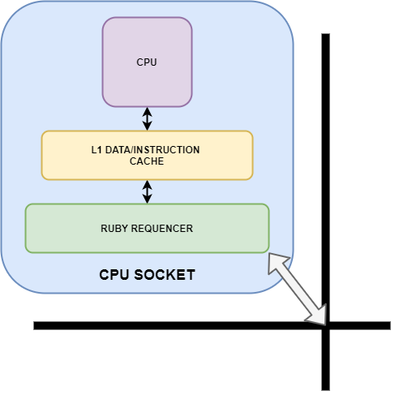

# NoC System Configuration

## 1. System configuration

### 1.1. Overview
How the system is composed: gernet + NoC system + NVM + Main Memory + cache in ogni socket collegata alla cpu
The project provides a framework for simulating a Network on Chip (NoC) 
system. Trought script configuration it is possible to set a matrix of 
interconnected elaboration unit and memory devices and launch bechmark 
programs to evaluate the performance of the above system. To simulate 
the NoC system the Garnet 3.0 detailed interconnection network model 
has been used with gem5 simulation framework. 

### 1.2. System configuration files

#### 1.2.1. socket.py
Contain definitions of NoC socket classes: **CPUSocket** and **DirectorySocket**.
**CPUSocket** class is the elaboration unit of the NoC system and contains 
as CPU default type the **TimingSimulationCPU**. Each CPUSocket has one 
RubyCache for data and instruction caches of the inner CPU, controlled 
by the L1CacheController with the support of "MI_example" protocol 
(gem5 default one) and the "MOESI_CMP_directory" protocol. In order to 
work with the Ruby system, the RubySequencer object is linked with the 
controller in order to handle the processor load/store/atomic memory requests.



**DirectorySocket** class is the memory unit of the NoC System and can be 
configured to support DDR as well as NVM memory types. The controller 
support the same protocols of the CPUSocket. Each NoC socket expose
the controller object in order to be linked to the interconnection
system.


#### 1.2.2. noc_network.py
It is responsible to spawn a socket for each NoC interconnected point 
as described by the **noc_config.py** file. Moreover, for each node, 
create the base elements to work with the Garnet system: GarnetRouter, 
GarnetExtLink, GarnetIntLink, and GarnetNetworkInterface. GarnetRouter 
represents the interconnection node and it is linked with the 
corresponding socket controller through the GarnetExtLink. 
GarnetIntLink, instead, form the NoC structure binding near 
routers to make a MeshXY topology. In addition, it is possible 
to specify the **link_latency** (delay between adjacent nodes) 
and the **router_latency** options (delay request to deliver the 
message to the socket controller).

#### 1.2.3. system_setup.py
Create the system base object, make the NoC subsystem
and link the software process to the socket CPUs. It is possible
to pass script parameters to configure some aspects of the simulated
system. The more important one is the noc_config.py file, described below.
Other important options are link_router and link_latency.

**link_router**: number of pipeline stages in the garnet router.

**link_latency**: latency of each link the garnet networks.

### 1.3. NoC Configuration
noc_config.py file descrive the NoC system topology. It has to be a 
rectangular matrix: can contains 'c' for CPU socket (elaboration unit), 
'v' or 'n' respectively for volatile and non volatile memory (storage 
unit).


example:
```
noc_config = [
    ["c", "c"],
    ["c", "c"],
    ["n", "v"]
]
```
This configuration simulate a NoC system composed by 4 CPUs in 
position (0,0) (0,1) (1,0) (1,1), one non-volatile memory in 
position (0,2) and one volatile memory at (1,2).


## 2. Executing a program
In this section we show how to run different programs on the NoC system.
As we previously describe, `conf/NoC/system_setup.py` configures the NoC system and runs the simulation.

We configure the binary that each core executes starting from line `133`, which we can tune accordingly to our requirements.

### 2.1. Single process / multiple threads
If we need to execute a program that manages the parallelization using threads, we need to specify a single process that is shared among the different cores of the NoC system.

For doing so, we create a process and we specify a binary executable for the process:
```
process = Process()
process.cmd = ['../benchmarks/a.out']
```

Then, we associate the process to each cpu core:
```
for (i, cpu) in enumerate(system.cpu):
    cpu.workload = process
    cpu.createThreads()
```

We can then execute the simulation with the following command:
```
build/X86/gem5.opt configs/soc-project/NoC/system_setup.py
```

### 2.2. Multiple processes
If we need to execute separate instances of the same program on all the CPU cores, we then need to specify a process for each core.
Hence, we can tune our system configuration as follows:
```
for (i, cpu) in enumerate(system.cpu):
    process = Process(pid = (100 + i))
    process.cmd = ['../benchmarks/a.out']
    cpu.workload = process
    cpu.createThreads()
```

We can then execute the simulation with the following command:
```
build/X86/gem5.opt configs/soc-project/NoC/system_setup.py
```

Each core will execute the specified binary indipendently from the other cores.

### 2.3. Multi-core/multi-thread
If we need to parallelize different programs, with some of them that manages its own parallelization through threads, we need to combine the two above system configurations.
We need to create a process for each different binary, and then we need to link each process to the CPU cores that will execute them.

For example, let us suppose we have two binaries, A and B.
The first CPU core executes A and the other three CPU cores execute B.

We first create one process for each binary:
```
processA = Process(pid=100)
processA.cmd = ['path/A']

processB = Process(pid=101)
processB.cmd = ['path/B']
```
Note that we need to specify a PID for each process.

Then, we link the processes to the CPU cores:
```
system.cpu[0].workload = processA
system.cpu[0].createThreads()

for core_id in range(1, 4):
    system.cpu[core_id].workload = processB
    system.cpu[core_id].createThreads()
```

We can then execute the simulation with the following command:
```
build/X86/gem5.opt configs/soc-project/NoC/system_setup.py
```
